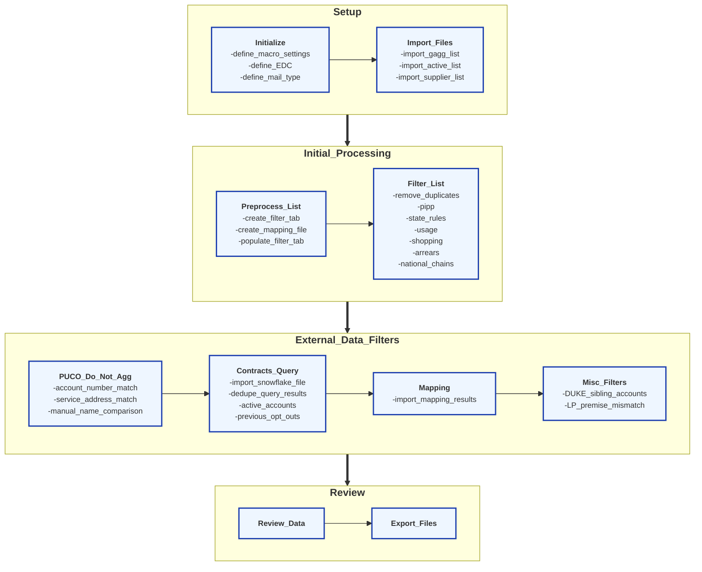
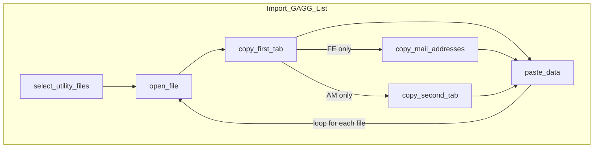

# Diagram Index

- [Overview](#overview)
- [Import File](#import-files)
- [Trim Data](#trim-data)
- [Export Results](#export-results)

## Overview


### Import Files



## Trim Data

```mermaid

    subgraph Trim_Data
    direction LR
        AM-->combine_sheets
        AES-->combine_sheets
        AEP-->combine_sheets
        COM-->combine_sheets
        DUKE-->combine_sheets
        FE-->combine_sheets
    end

    subgraph AEP
    direction LR
        AEP_delete_first_col
        AEP_delete_last_row
        AEP_delete_second_row
        AEP_delete_empty_cols
    end

    subgraph AES
    direction LR
        AES_delete_first_10_rows
    end

    subgraph AM
    direction LR
        AM_delete_first_10_rows
        AM_unmerge_columns
    end

    subgraph COM
    direction LR
        COM_do_nothing
    end

    subgraph DUKE
    direction LR
        DUKE_do_nothing
    end

    subgraph FE
    direction LR
        FE_delete_first_column
        FE_delete_second_row
    end

    subgraph Format_Utility_Data
    direction LR
        remove_tabs_from_headers --> find_account_column
        Format_Account_Numbers --> dedupe_accounts
    end

    subgraph Format_Account_Numbers
    direction LR
        format_as_string -->|"FE"| A["080*<br>add_leading_zeros<br>len=20"]
        format_as_string -->|"OP"| B["001400607*<br>add_leading_zeros<br>len=17"]
        format_as_string -->|"CS"| C["000406210*<br>add_leading_zeros<br>len=17"]
        format_as_string -->|"AES"| D["080*<br>add_leading_zeros<br>len=23"]
        format_as_string -->|"DUKE"| E["[#x12]Z[#x9]<br>add_leading_zeros<br>len=22"]
        format_as_string -->|"AM"| F["*<br>add_leading_zeros<br>len=10"]
        format_as_string -->|"COM"| G["*<br>add_leading_zeros<br>len=10"]
    end

    find_account_column --> format_as_string

```
