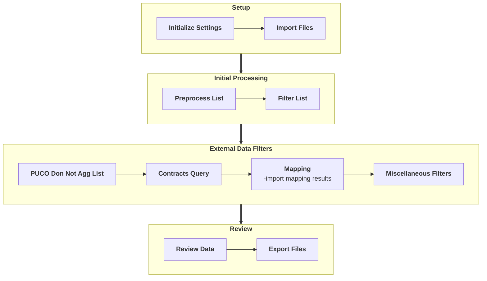
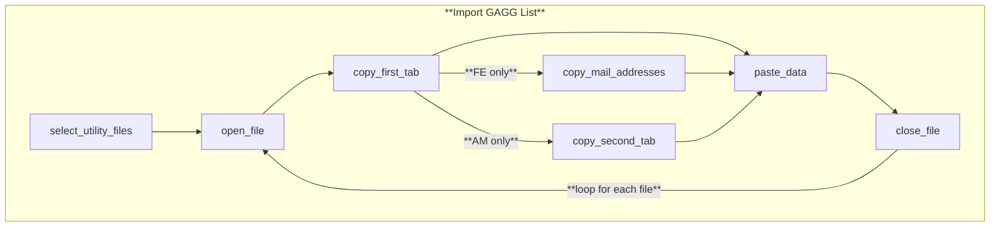

# Diagram Index

- [Overview](#overview)
- [Import File](#import-files)
- [Trim Data](#trim-data)

## Overview



## Import Files



## Preprocess Data

```mermaid

%%{init: {
  "theme": "base",
  "themeVariables": {
    "fontSize": "12px",
    "fontFamily": "Segoe UI",
    "primaryColor": "#eef6ff",          %% node fill
    "primaryBorderColor": "#1e40af",    %% node border
    "primaryTextColor": "#0f172a",      %% node text
    "lineColor": "#1e40af"
  }
}}%%

'''

### Trim Data

```mermaid

%%{init: {
  "theme": "base",
  "themeVariables": {
    "fontSize": "12px",
    "fontFamily": "Segoe UI",
    "primaryColor": "#eef6ff",          %% node fill
    "primaryBorderColor": "#1e40af",    %% node border
    "primaryTextColor": "#0f172a",      %% node text
    "lineColor": "#1e40af"
  }
}}%%

graph TD

    subgraph Trim_Data["**Trim Data**"]
    direction TB
        %%AM --> combine_sheets
        %%AES --> combine_sheets
        %%AEP --> combine_sheets
        %%COM --> combine_sheets
        %%DUKE --> combine_sheets
        %%FE --> combine_sheets
        %%AM---AEP---AES---COM---DUKE---FE
        new_tab -->|"**AM**"| trim_AM["AM_delete_first_10_rows<br>AM_unmerge_columns"] --> combine_sheets
        new_tab -->|"**AEP**"| trim_AEP["AEP_delete_first_col<br>AEP_delete_last_row<br>AEP_delete_second_row<br>AEP_delete_empty_cols"] --> combine_sheets
        new_tab -->|"**AES**"| trim_AES["AES_delete_first_10_rows"] --> combine_sheets
        new_tab -->|"**FE**"| trim_FE["FE_delete_first_column<br>FE_delete_second_row"] --> combine_sheets
        %%new_tab -->|"**COM**"| no_action["do nothing"] --> combine_sheets
        %%new_tab -->|"**DUKE**"| no_action["do nothing"] -->combine_sheets
        new_tab -->|"**COM**"| combine_sheets
        new_tab -->|"**DUKE**"| combine_sheets
        

    end

    %%subgraph AEP[" "]
    %%direction LR
    %%    trim_AEP["AEP_delete_first_col<br>AEP_delete_last_row<br>AEP_delete_second_row<br>AEP_delete_empty_cols"]
    %%end

    %%subgraph AES[" "]
    %%direction LR
    %%    trim_AES["AES_delete_first_10_rows"]
    %%end

    %%subgraph AM[" "]
    %%direction LR
    %%    trim_AM["AM_delete_first_10_rows<br>AM_unmerge_columns"]
    %%end

    %%subgraph FE[" "]
    %%direction LR
    %%    trim_FE["FE_delete_first_column<br>FE_delete_second_row"]
    %%end

    subgraph Format_Utility_Data["**Format Utility Data**"]
    direction LR
        remove_tabs_from_headers --> find_account_column
    end

    subgraph Format_Account_Numbers["**Format Account Numbers**"]
    direction TB
        format_as_string -->|"**OE/TE/CEI**"| A["080*<br>len=20"]
        format_as_string -->|"**OP**"| B["001400607*<br>len=17"]
        format_as_string -->|"**CS**"| C["000406210*<br>len=17"]
        format_as_string -->|"**AES**"| D["080*<br>len=23"]
        format_as_string -->|"**DUKE**"| E["[#x12]Z[#x9]<br>len=22"]
        format_as_string -->|"**AM**"| F["*(no pattern)<br>len=10"]
        format_as_string -->|"**COM**"| G["*(no pattern)<br>len=10"]
        %%A-.->B-.->C-.->D-.->E-.->F-.->G
        A--> dedupe_accounts
        B--> dedupe_accounts
        C--> dedupe_accounts
        D--> dedupe_accounts
        E--> dedupe_accounts
        F--> dedupe_accounts
        G--> dedupe_accounts
    end

    Trim_Data ==> Format_Utility_Data
    Format_Utility_Data ==> Format_Account_Numbers

```
