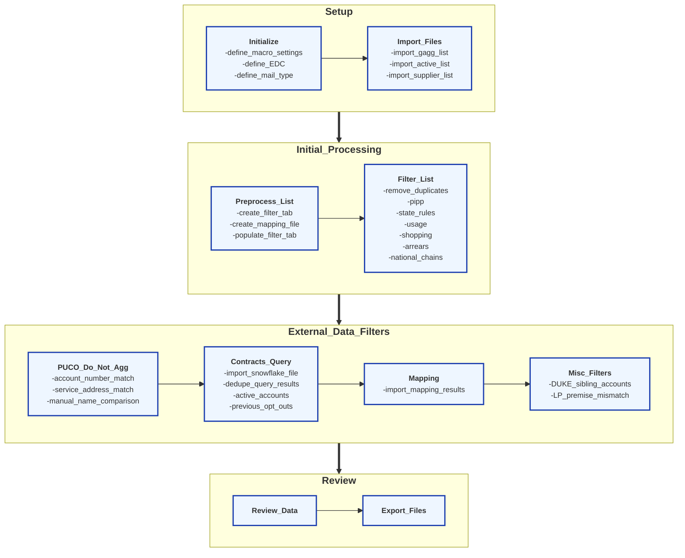
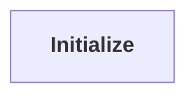

```mermaid

flowchart TB

classDef classNode fill:#eef6ff,stroke:#1e40af,stroke-width:2px,font-size:12px

%% Nodes
Initialize["<b>Initialize</b><br>-define_macro_settings<br>-define_EDC<br>-define_mail_type<br>"]:::classNode
Import_Files["<b>Import_Files</b><br>-import_gagg_list<br>-import_active_list<br>-import_supplier_list"]:::classNode
Preprocess_List["<b>Preprocess_List</b><br>-create_filter_tab<br>-create_mapping_file<br>-populate_filter_tab"]:::classNode
Filter_List["<b>Filter_List</b><br>-remove_duplicates<br>-pipp<br>-state_rules<br>-usage<br>-shopping<br>-arrears<br>-national_chains"]:::classNode
PUCO_Do_Not_Agg["<b>PUCO_Do_Not_Agg</b><br>-account_number_match<br>-service_address_match<br>-manual_name_comparison"]:::classNode
Contracts_Query["<b>Contracts_Query</b><br>-import_snowflake_file<br>-dedupe_query_results<br>-active_accounts<br>-previous_opt_outs"]:::classNode
Mapping["<b>Mapping</b><br>-import_mapping_results"]:::classNode
Misc_Filters["<b>Misc_Filters</b><br>-DUKE_sibling_accounts<br>-LP_premise_mismatch"]:::classNode
Review_Data["<b>Review_Data</b>"]:::classNode
Export_Files["<b>Export_Files</b>"]:::classNode

subgraph Setup["<b>Setup</b>"]
direction LR
    Initialize --> Import_Files
end

subgraph Initial_Processing["<b>Initial_Processing</b>"]
direction LR
    Preprocess_List --> Filter_List
end

subgraph External_Data_Filters["<b>External_Data_Filters</b>"]
direction LR
    PUCO_Do_Not_Agg --> Contracts_Query --> Mapping --> Misc_Filters
end

subgraph Review["<b>Review</b>"]
direction LR
    Review_Data --> Export_Files
end

Setup ==> Initial_Processing ==> External_Data_Filters ==> Review

```

```mermaid

graph
direction LR

Initialize["<b>Initialize</b>"]

```
