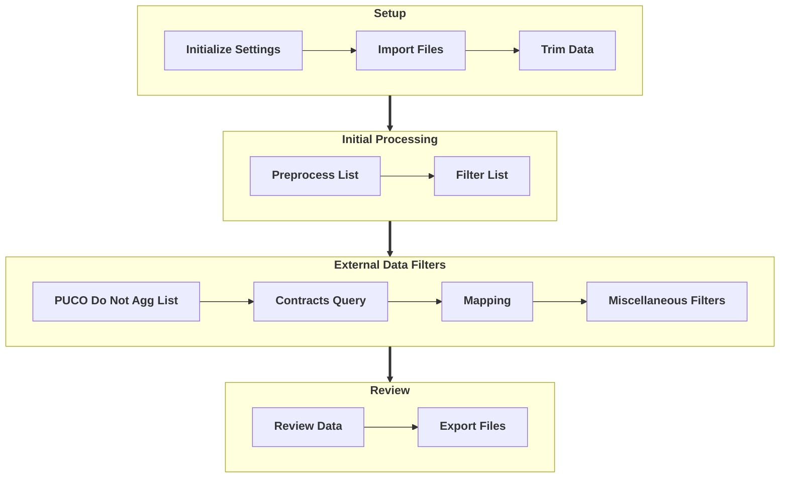
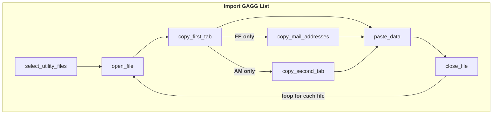
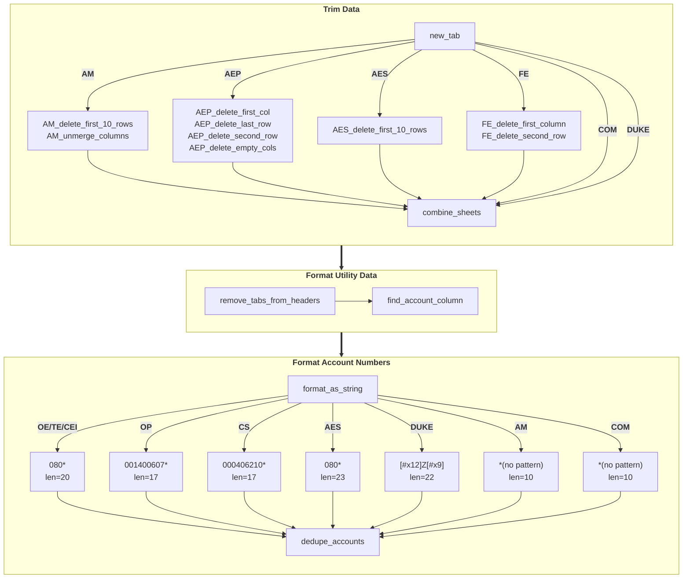
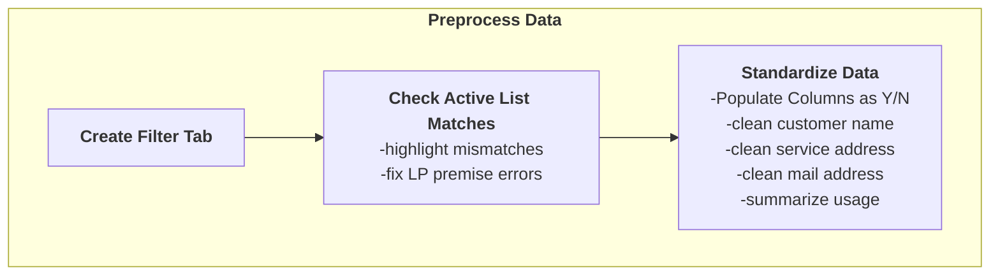
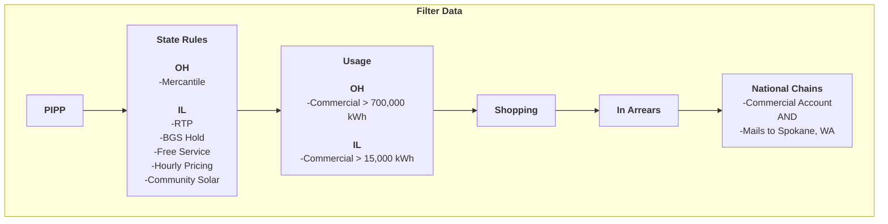
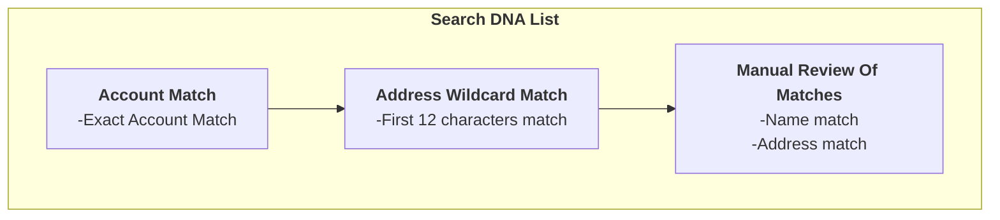
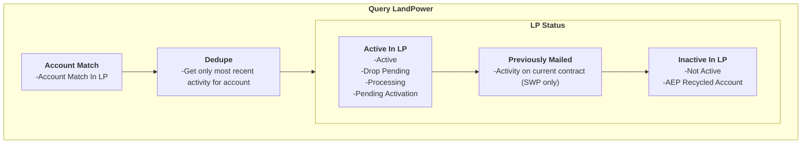
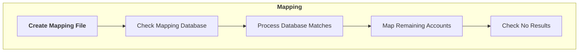

# Diagram Index

- [Overview](#overview)
- [Import File](#import-files)
- [Trim Data](#trim-data)
- [Preprocess Data](#preprocess-data)
- [Filter Data](#filter-data)
- [PUCO Do Not Agg List](#puco-do-not-agg-list)
- [Contracts Query](#contracts-query)
- [Geocoding](#geocoding)

## Overview

```mermaid

%%{init: {
  "theme": "base",
  "themeVariables": {
    "fontSize": "12px",
    "fontFamily": "Segoe UI",
    "primaryColor": "#eef6ff",          %% node fill
    "primaryBorderColor": "#1e40af",    %% node border
    "primaryTextColor": "#0f172a",      %% node text
    "lineColor": "#1e40af"
  }
}}%%

flowchart TB

classDef classNode fill:#eef6ff,stroke:#1e40af,stroke-width:2px,font-size:12px

%% Nodes
Initialize["<b>Initialize</b><br>-define_macro_settings<br>-define_EDC<br>-define_mail_type<br>"]
Import_Files["<b>Import_Files</b><br>-import_gagg_list<br>-import_active_list<br>-import_supplier_list<br>-trim_data"]
Preprocess_List["<b>Preprocess_List</b><br>-create_filter_tab<br>-create_mapping_file<br>-populate_filter_tab"]
Filter_List["<b>Filter_List</b><br>-remove_duplicates<br>-pipp<br>-state_rules<br>-usage<br>-shopping<br>-arrears<br>-national_chains"]
PUCO_Do_Not_Agg["<b>PUCO Do Not Agg</b><br>-account_number_match<br>-service_address_match<br>-manual_name_comparison"]
Contracts_Query["<b>Contracts_Query</b><br>-import_snowflake_file<br>-dedupe_query_results<br>-active_accounts<br>-previous_opt_outs"]
Mapping["<b>Mapping</b>"]
Misc_Filters["<b>Miscellaneous Filters</b><br>-DUKE sibling accounts<br>-LP Premise Mismatch"]
Review_Data["<b>Review Data</b>"]
Export_Files["<b>Export Files</b>"]

subgraph Setup["<b>Setup</b>"]
direction LR
    Initialize["<b>Initialize Settings</b>"] --> Import_Files["<b>Import Files</b>"] --> Trim_Data["<b>Trim Data</b>"]
end

subgraph Initial_Processing["<b>Initial Processing</b>"]
direction LR
    Preprocess_List["<b>Preprocess List</b>"] --> Filter_List["<b>Filter List</b>"]
end

subgraph External_Data_Filters["<b>External Data Filters</b>"]
direction LR
    PUCO_Do_Not_Agg["<b>PUCO Do Not Agg List</b>"] --> Contracts_Query["<b>Contracts Query</b>"] --> Mapping --> Misc_Filters["<b>Miscellaneous Filters</b>"]
end

subgraph Review["<b>Review</b>"]
direction LR
    Review_Data["<b>Review Data</b>"] --> Export_Files["<b>Export Files</b>"]
end

Setup ==> Initial_Processing["<b>Initial Processing</b>"] ==> External_Data_Filters["<b>External Data Filters</b>"] ==> Review

```

## Import Files

```mermaid

%%{init: {
  "theme": "base",
  "themeVariables": {
    "fontSize": "12px",
    "fontFamily": "Segoe UI",
    "primaryColor": "#eef6ff",          %% node fill
    "primaryBorderColor": "#1e40af",    %% node border
    "primaryTextColor": "#0f172a",      %% node text
    "lineColor": "#1e40af"
  }
}}%%

graph TD

    subgraph Import_GAGG_List["<b>Import GAGG List</b>"]
    direction LR
        select_utility_files --> open_file
        open_file --> copy_first_tab
        copy_first_tab --> paste_data
        copy_first_tab -->|"<b>FE only</b>"| copy_mail_addresses
        copy_first_tab -->|"<b>AM only</b>"| copy_second_tab
        copy_mail_addresses --> paste_data
        copy_second_tab --> paste_data
        close_file -->|"<b>loop for each file</b>"| open_file
        paste_data --> close_file
    end
```

## Trim Data

```mermaid

%%{init: {
  "theme": "base",
  "themeVariables": {
    "fontSize": "12px",
    "fontFamily": "Segoe UI",
    "primaryColor": "#eef6ff",          %% node fill
    "primaryBorderColor": "#1e40af",    %% node border
    "primaryTextColor": "#0f172a",      %% node text
    "lineColor": "#1e40af"
  }
}}%%

graph TD

    subgraph Trim_Data["<b>Trim Data</b>"]
    direction TB
        %%AM --> combine_sheets
        %%AES --> combine_sheets
        %%AEP --> combine_sheets
        %%COM --> combine_sheets
        %%DUKE --> combine_sheets
        %%FE --> combine_sheets
        %%AM---AEP---AES---COM---DUKE---FE
        new_tab -->|"<b>AM</b>"| trim_AM["AM_delete_first_10_rows<br>AM_unmerge_columns"] --> combine_sheets
        new_tab -->|"<b>AEP</b>"| trim_AEP["AEP_delete_first_col<br>AEP_delete_last_row<br>AEP_delete_second_row<br>AEP_delete_empty_cols"] --> combine_sheets
        new_tab -->|"<b>AES</b>"| trim_AES["AES_delete_first_10_rows"] --> combine_sheets
        new_tab -->|"<b>FE</b>"| trim_FE["FE_delete_first_column<br>FE_delete_second_row"] --> combine_sheets
        %%new_tab -->|"<b>COM</b>"| no_action["do nothing"] --> combine_sheets
        %%new_tab -->|"<b>DUKE</b>"| no_action["do nothing"] -->combine_sheets
        new_tab -->|"<b>COM</b>"| combine_sheets
        new_tab -->|"<b>DUKE</b>"| combine_sheets
        

    end

    %%subgraph AEP[" "]
    %%direction LR
    %%    trim_AEP["AEP_delete_first_col<br>AEP_delete_last_row<br>AEP_delete_second_row<br>AEP_delete_empty_cols"]
    %%end

    %%subgraph AES[" "]
    %%direction LR
    %%    trim_AES["AES_delete_first_10_rows"]
    %%end

    %%subgraph AM[" "]
    %%direction LR
    %%    trim_AM["AM_delete_first_10_rows<br>AM_unmerge_columns"]
    %%end

    %%subgraph FE[" "]
    %%direction LR
    %%    trim_FE["FE_delete_first_column<br>FE_delete_second_row"]
    %%end

    subgraph Format_Utility_Data["<b>Format Utility Data</b>"]
    direction LR
        remove_tabs_from_headers --> find_account_column
    end

    subgraph Format_Account_Numbers["<b>Format Account Numbers</b>"]
    direction TB
        format_as_string -->|"<b>OE/TE/CEI</b>"| A["080*<br>len=20"]
        format_as_string -->|"<b>OP</b>"| B["001400607*<br>len=17"]
        format_as_string -->|"<b>CS</b>"| C["000406210*<br>len=17"]
        format_as_string -->|"<b>AES</b>"| D["080*<br>len=23"]
        format_as_string -->|"<b>DUKE</b>"| E["[#x12]Z[#x9]<br>len=22"]
        format_as_string -->|"<b>AM</b>"| F["*(no pattern)<br>len=10"]
        format_as_string -->|"<b>COM</b>"| G["*(no pattern)<br>len=10"]
        %%A-.->B-.->C-.->D-.->E-.->F-.->G
        A--> dedupe_accounts
        B--> dedupe_accounts
        C--> dedupe_accounts
        D--> dedupe_accounts
        E--> dedupe_accounts
        F--> dedupe_accounts
        G--> dedupe_accounts
    end

    Trim_Data ==> Format_Utility_Data
    Format_Utility_Data ==> Format_Account_Numbers

```

## Preprocess Data

```mermaid

%%{init: {
  "theme": "base",
  "themeVariables": {
    "fontSize": "12px",
    "fontFamily": "Segoe UI",
    "primaryColor": "#eef6ff",          %% node fill
    "primaryBorderColor": "#1e40af",    %% node border
    "primaryTextColor": "#0f172a",      %% node text
    "lineColor": "#1e40af"
  }
}}%%

graph TD

    subgraph Preprocess_Data["<b>Preprocess Data</b>"]
    direction LR
        create_filter_tab["<b>Create Filter Tab</b>"] --> check_active_matches["<b>Check Active List Matches</b><br>-highlight mismatches<br>-fix LP premise errors"]
        check_active_matches --> standardize_data["<b>Standardize Data</b><br>-Populate Columns as Y/N<br>-clean customer name<br>-clean service address<br>-clean mail address<br>-summarize usage"]
    end

```
## Filter Data

```mermaid

%%{init: {
  "theme": "base",
  "themeVariables": {
    "fontSize": "12px",
    "fontFamily": "Segoe UI",
    "primaryColor": "#eef6ff",          %% node fill
    "primaryBorderColor": "#1e40af",    %% node border
    "primaryTextColor": "#0f172a",      %% node text
    "lineColor": "#1e40af"
  }
}}%%

graph TD

    subgraph Filter_Data["<b>Filter Data</b>"]
    direction LR
        PIPP["<b>PIPP</b>"]
        State_Rules["<b>State Rules</b><br><br><b>OH</b><br>-Mercantile<br><b><br>IL</b><br>-RTP<br>-BGS Hold<br>-Free Service<br>-Hourly Pricing<br>-Community Solar<br>"]
        Usage["<b>Usage</b><br><br><b>OH</b><br>-Commercial > 700,000 kWh<br><br><b>IL</b><br>-Commercial > 15,000 kWh"]
        Shopping["<b>Shopping</b>"]
        Arrears["<b>In Arrears</b>"]
        National_Chains["<b>National Chains</b><br>-Commercial Account<br>AND<br>-Mails to Spokane, WA"]
        PIPP --> State_Rules --> Usage --> Shopping --> Arrears --> National_Chains
    end

```

## PUCO Do Not Agg List

```mermaid

%%{init: {
  "theme": "base",
  "themeVariables": {
    "fontSize": "12px",
    "fontFamily": "Segoe UI",
    "primaryColor": "#eef6ff",          %% node fill
    "primaryBorderColor": "#1e40af",    %% node border
    "primaryTextColor": "#0f172a",      %% node text
    "lineColor": "#1e40af"
  }
}}%%

graph TD

    subgraph DNA_search["<b>Search DNA List</b>"]
    direction LR
        account_match["<b>Account Match</b><br>-Exact Account Match"]
        address_match["<b>Address Wildcard Match</b><br>-First 12 characters match"]
        manual_review["<b>Manual Review Of Matches</b><br>-Name match<br>-Address match"]
        account_match --> address_match --> manual_review
    end

```

## Contracts Query

```mermaid

%%{init: {
  "theme": "base",
  "themeVariables": {
    "fontSize": "12px",
    "fontFamily": "Segoe UI",
    "primaryColor": "#eef6ff",          %% node fill
    "primaryBorderColor": "#1e40af",    %% node border
    "primaryTextColor": "#0f172a",      %% node text
    "lineColor": "#1e40af"
  }
}}%%

graph TD

    subgraph contracts["<b>Query LandPower</b>"]
    direction LR
        query["<b>Account Match</b><br>-Account Match In LP"]
        dedupe["<b>Dedupe</b><br>-Get only most recent activity for account"]
        query --> dedupe --> LP_status
    end

    subgraph LP_status["<b>LP Status</b>"]
    direction LR
        active["<b>Active In LP</b><br>-Active<br>-Drop Pending<br>-Processing<br>-Pending Activation"]
        opt_out["<b>Previously Mailed</b><br>-Activity on current contract (SWP only)"]
        inactive["<b>Inactive In LP</b><br>-Not Active<br>-AEP Recycled Account"]
        active --> opt_out --> inactive
    end

```

## Geocoding

```mermaid

%%{init: {
  "theme": "base",
  "themeVariables": {
    "fontSize": "12px",
    "fontFamily": "Segoe UI",
    "primaryColor": "#eef6ff",          %% node fill
    "primaryBorderColor": "#1e40af",    %% node border
    "primaryTextColor": "#0f172a",      %% node text
    "lineColor": "#1e40af"
  }
}}%%

graph TD

    subgraph mapping["<b>Mapping</b>"]
    direction LR
        populate_mapping["<b>Create Mapping File</b>"] --> query_db["Check Mapping Database"] --> process_db_results["Process Database Matches"]
        process_db_results --> map_remaining["Map Remaining Accounts"] --> no_results["Check No Results"]
    end


```
